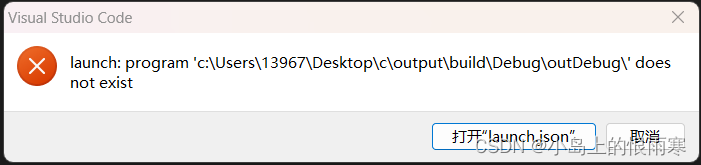
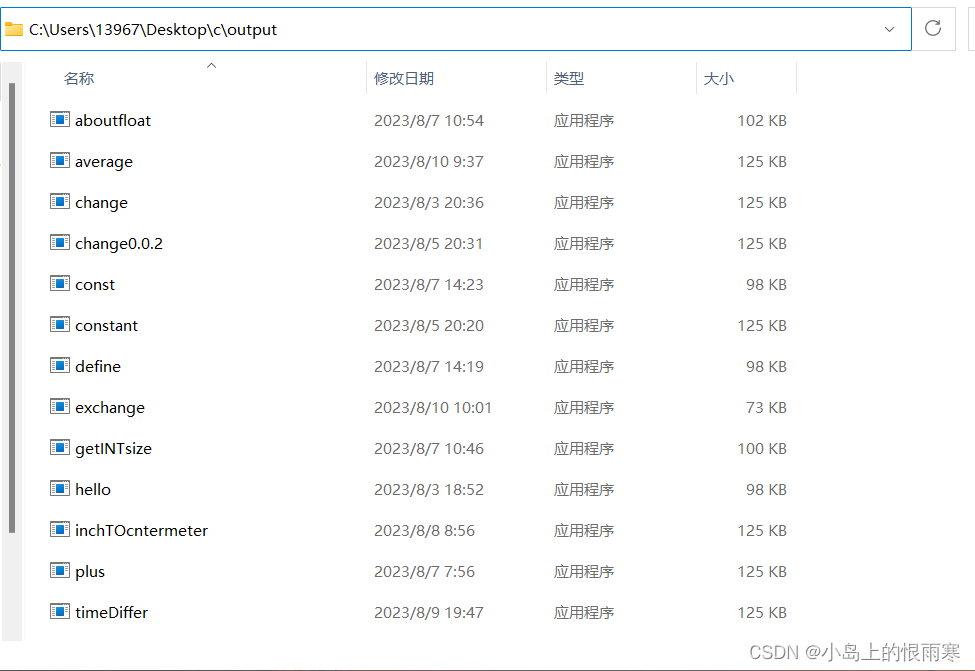
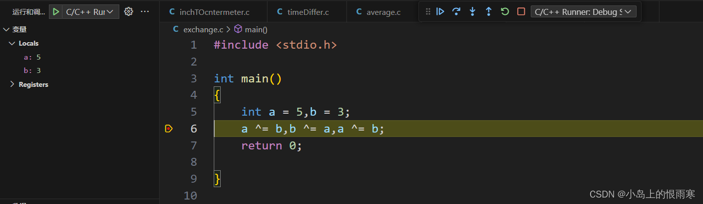

在vs code开发代码的途中，我们可能会在运行或调试的途中碰到“launch: program ‘c: \build\Debug\outDebug‘ does not exist”的问题，如图所示。



这里我们按照提示打开`launch.json`

```json
{
  "version": "0.2.0",
  "configurations": [
    {
      "name": "C/C++ Runner: Debug Session",
      "type": "cppdbg",
      "request": "launch",
      "args": [],
      "stopAtEntry": false,
      "externalConsole": true,
      "cwd": "c:/Users/13967/Desktop/c/output",
      "program": "c:/Users/13967/Desktop/c/output/build/Debug/outDebug/",
      "MIMode": "gdb",
      "miDebuggerPath": "gdb",
      "setupCommands": [
        {
          "description": "Enable pretty-printing for gdb",
          "text": "-enable-pretty-printing",
          "ignoreFailures": true
        }
      ]
    }
  ]
}
```

经过观察，我发现问题应当出现在`program`里

```json
"program": "c:/Users/13967/Desktop/c/output/build/Debug/outDebug/",
```

这里定位到了代码的具体位置，但是这个位置不够准确。



如图，我写的C语言代码的编译结果都储存在`C:\Users\13967\Desktop\c\output`里面。

而不是`launch.json`中的`c:/Users/13967/Desktop/c/output/build/Debug/outDebug/`

因此我们首先要**将文件位置改成自己电脑中存放C语言编译结果的文件夹**，然后再在后面加上一行`“`${fileBasenameNoExtension}.exe`”`用于定位具体的.exe应用程序。

以我的电脑为例，最后改成这样：

`program": "c:/Users/13967/Desktop/c/output/${fileBasenameNoExtension}.exe`



问题成功解决！如图所示代码已经可以设置断点并且进行调试力。

参考资料：

[麦克斯韦猿的CSDN博客](https://blog.csdn.net/m0_55957625/article/details/130466016)

[Microsoft的Q&A问答社区](https://learn.microsoft.com/en-us/answers/questions/1240097/how-to-fix-builddebugoutdebug-does-not-exist)