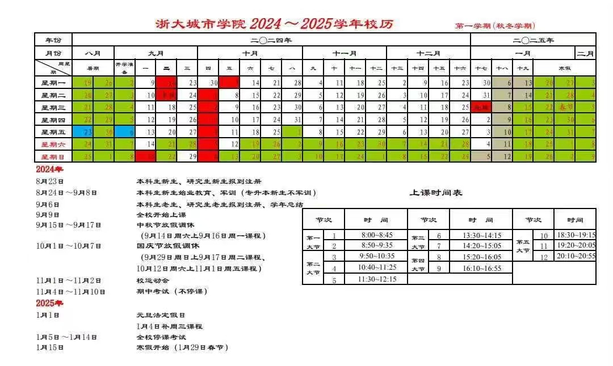
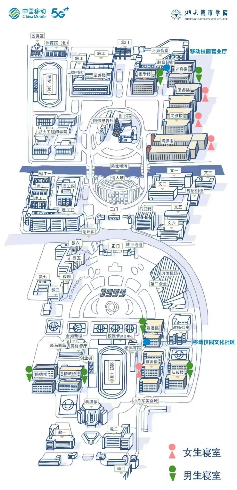

### 简介

作为目前HZCU最年轻的学长（两个月前我还是学弟），起初我满怀雄心壮志，计划在暑假开发一个名为“HZCU新生指南”的前端项目。这个项目构想中是一个网站，包含Q&A问答平台、校园地图、校历等丰富的资料。

然而，计划总是赶不上变化，或者说变化从未真正发生。7月份，我全月参与了Pac比赛（顺便提一下，欢迎在大一下或者大二上加入超算中心），而这个雄心勃勃的项目至今尚未启动。实际上，这并非我首个烂掉的的项目。还有一个名为“CPEHelper”的项目，原计划是创建一个帮助大家完成大学物理实验的网站，但最终我仅开发了一个功能简陋、带有早期互联网特色的平均值和标准差计算器。

也许你会有兴趣看看它有多烂：[烂掉的CPEhelper](https://baozhuhan.github.io/CPEhelper/)

时间流转至8月，随着比赛的结束，漫长的假期变得无聊且难熬。5月底，我不幸摔伤了脚，伤筋动骨一百天，目前才刚刚能够下地行走，无法外出。自学了一些下学期将要使用的Java知识，但总觉得应该做些什么。

于是，我决定编写这份《HZCU软件工程新生指北》。

### 注意

* 这份指北完全由我个人编写，因此它不具备官方效力，内容也可能不完全准确。

* 在开学前，**大家最重要的任务是完成录取通知书上规定的事项**。那些才是真正必要的。

* 此外，关于普通大学指南和浙大城市学院的大学指南，网上已有大量资料，因此我不打算重复这些内容。这份指南主要面向软件工程新生，宽泛地说，计算机学院的学生也可以使用。

* 如果我记得的话，我会不断更新这份指北，也欢迎你来提Issue

* 如果这份指北对你有帮助，那么请给这个项目点一个Star，或者Follow我一下，谢谢。

### 开学前我们要做什么

1. 一步一步完成“录取通知书”和“录取通知书附件”上面的要求。
2. 加入
   QQ群 `646484322`（浙大城市学院2024大群），
   QQ群 `994374755`（计算学院2024大群），
   微信班级群（查看计算学院大群群相册），
   找到组织（捞捞软件工程2402:sob）。
3. 准备一些开学需要的东西，我更加推荐大家把喜欢的东西先放在购物车里面，因为在军训时，内务管理可能不会允许大家在桌子上有太多的东西。
4. 玩得尽兴，宝子。

### 常用网站

以下是我们常用的一些网站链接，推荐大家把他们放到收藏夹里面：

* 官方网站：

  * [浙大城市学院官网](http://www.zucc.edu.cn/)
  * [浙大城市学院计算机与计算科学学院官网](http://jsxy.zucc.edu.cn/)（顺便记住我们学院的全名，会用得上）
  * [教务系统](http://ijw.hzcu.edu.cn/xtgl/login_slogin.html)（主要用于选课）
  * [学在城院](https://course.hzcu.edu.cn/hzcu)（大部分课程的作业提交平台）
* 课程网站
  * [MOOC](https://www.icourse163.org/)（一些课程在MOOC辅修同名课程可以加分）
  * [拼题A](https://pintia.cn/)（一些编程专业课会在这里发布作业）
  * [学习通](https://v8.chaoxing.com/)（思政类课程记得在这里把课刷完，考试前写几遍模拟题都能过）
  * [iwrite](https://iwrite.unipus.cn/login)（大英课写作文的）
  * [itest](https://itestcloud.unipus.cn/)（大英课写测试的）
  * [u校园](https://u.unipus.cn/)（大英课的课本辅助资料，省流：不咋用）
* 常用网站：

  * [GitHub](https://github.com/)（全球最大的代码托管平台和开源软件社区）
  * [Bing](https://cn.bing.com/?mkt=zh-CN)（我希望你能够逐渐忘记百度这个搜索引擎）
  * [CSDN](https://www.csdn.net/)（如果你的英文水平有限，这里是获取资料的重要渠道）
  * [w3schools](https://w3schools.com/)（还记得我在学Java吗，就是在这里，你可以自学很多语言）

  ......

### 关于军训

我理解大家非常的担心，但是其实没有那么可怕，学校会做好全面的后勤保障工作，即使你什么都没有准备，那也没有什么关系。  

当然最好准备好：防晒霜，弹力鞋垫，皮带。  

水会由学校统一购置矿泉水，自带的水瓶是没必要的，外露的特殊防护（比如袖套）都是被禁止的，所以你看，没什么好担心的。  

药品，学校会准备好的，每个连队都会有卫生员。  

**Note** 如果身体抱恙，请关注学校的通知，及时提交相关医院的证明，可以申请跟训。  

### 学校的校历和地图

（如果你不会科学上网，可能下面的图片不会加载地很流畅，见谅）

**Note** 地图仅供参考，不少店家都是过期的，新生的新楼在地图中南校菜鸟驿站西侧。

### 我想做更多

1. 报道后的第一次班会课会进行一次听力考试，听力考试按照四六级格式，为分班提供依据。
> 你的打怪升级路线：  
> 如果考试成绩偏低：大学英语2级 -> 大学英语3级 -> 大学英语4级  
> 如果考试成绩偏高：大学英语3级 -> 大学英语4级 -> 大学英语综合应用能力实训  

2. 趁着高中的老本还有一些，一鼓作气，准备拿下英语四级考试(425分合格)

3. 报道后的第一次班会课会选拔班干部，包括：
> 班长（必须是团员）  
> 团支书 （必须是团员）  
> 学习委员  
> 生活委员  
> 文体委员  
> 组宣委员 
> 心理委员（男和女各一人）

一般采用毛遂自荐，民主投票的方法，大家可以积极准备

4. 军训期间会写入党申请书，可以先打打草稿。

写累了，先这样，剩下的晚点更新，大家有想法可以提issue，熟练Github是一个优秀的码农必备的技能，加油吧。