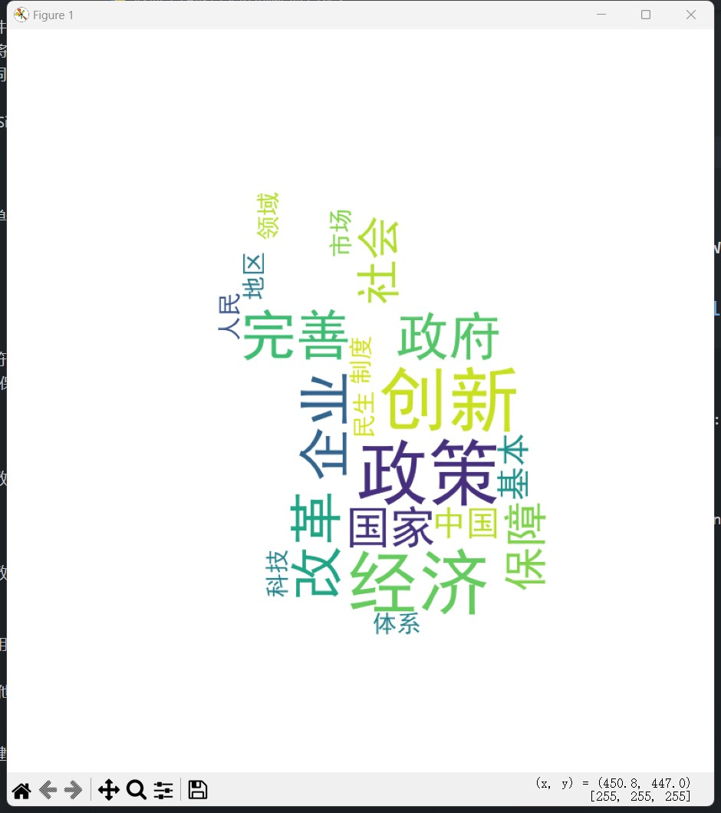
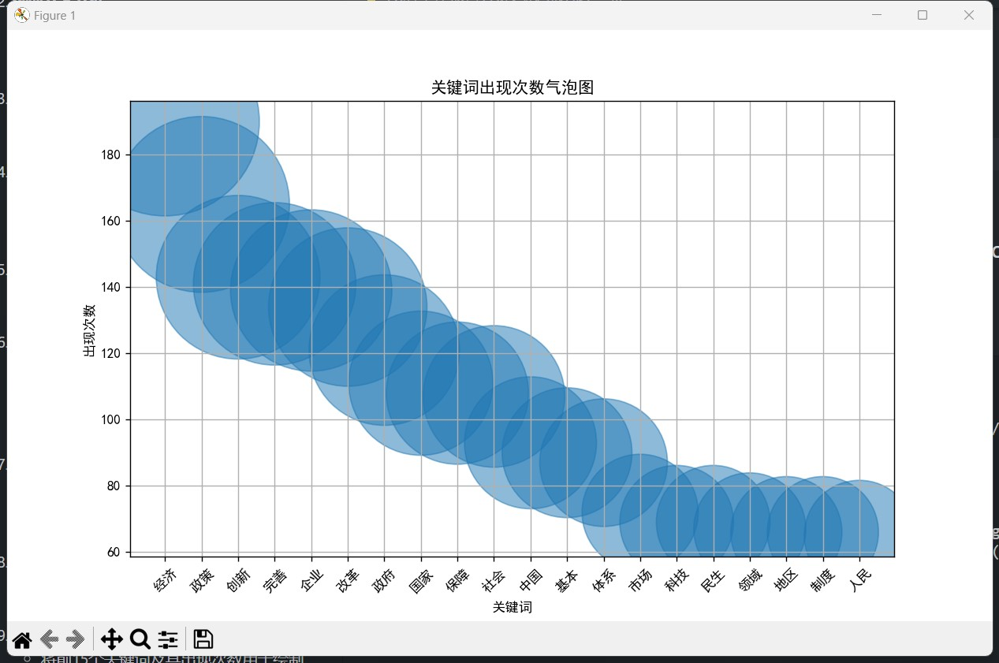
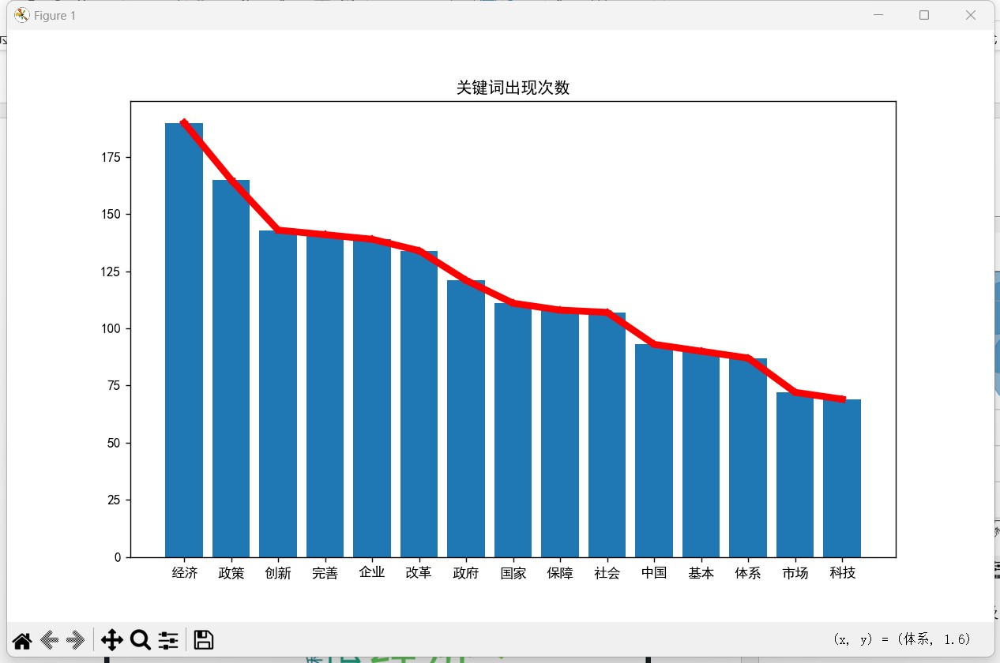
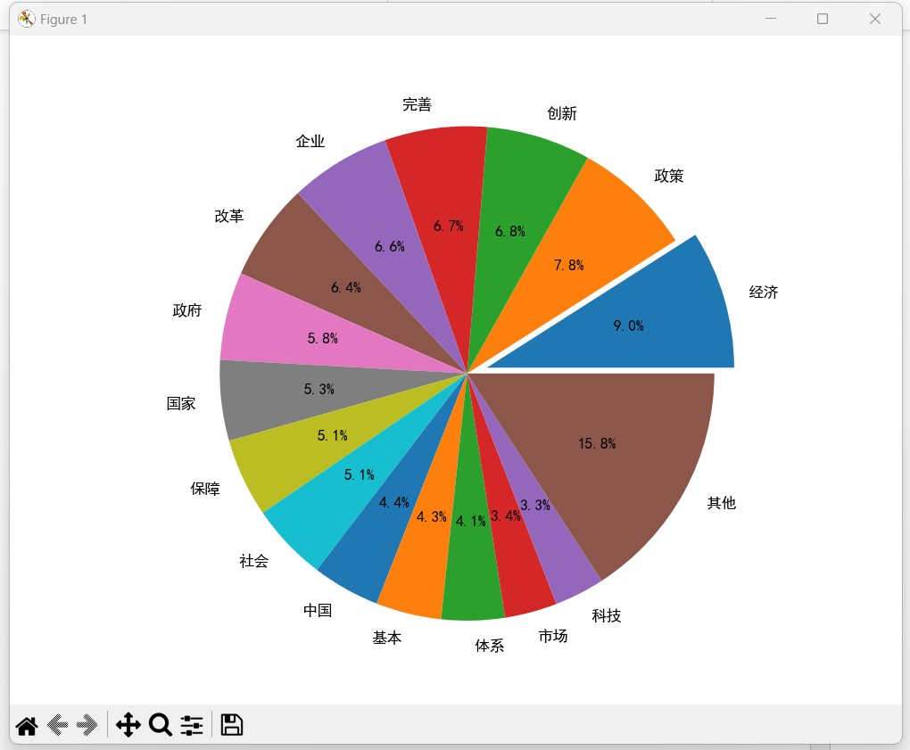
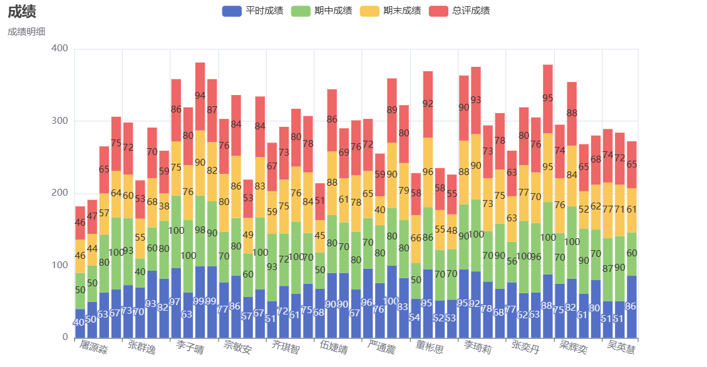
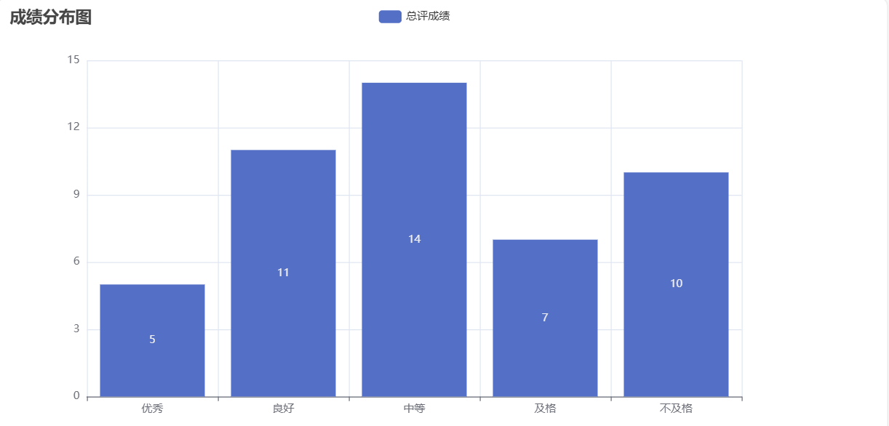
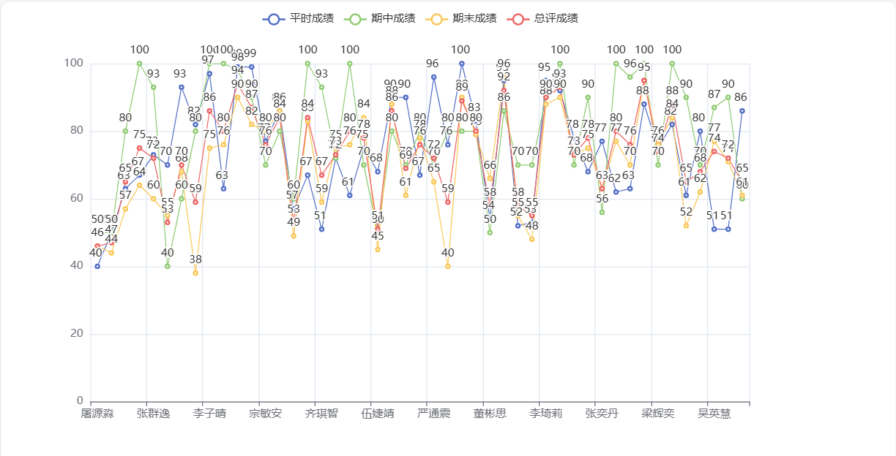
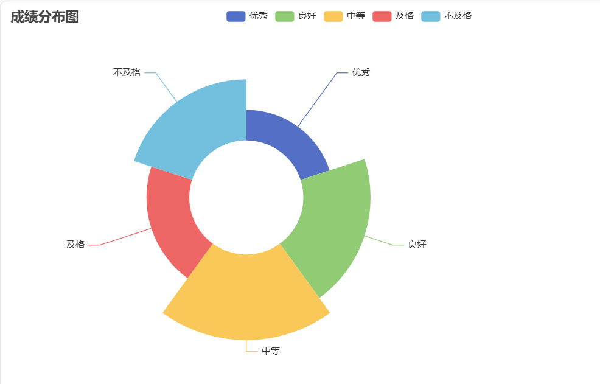
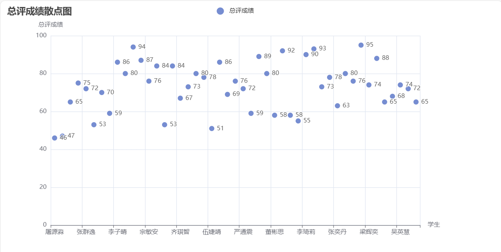
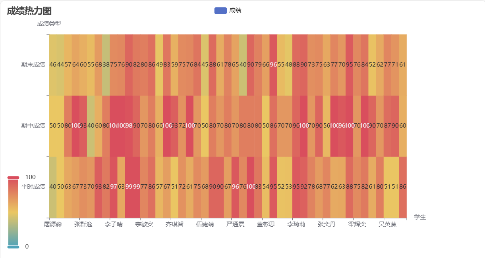

*本库包含作业答案，请确保阅读并完全同意[重要声明](https://baozhuhan.github.io//p/2024070101/)*

## 程序报告部分
### 简单文本处理
#### 一．问题描述
文本分析，计算高频词并用词云显示
自定主题和素材：为了悼念故去的李克强总理，我收集了2021年至2024年的政府工作报告，利用词云等方式统计显示出现频率最高的词汇，展现了中国共产党的优秀党员，久经考验的忠诚的共产主义战士，杰出的无产阶级革命家、政治家，党和国家的卓越领导人李克强同志为人民服务做出的卓越贡献。<br>

要求：
* 排除与无关紧要的部分动词和形容词如“大力”，“推动”；
* 排除单个字符的分词结果；
* 输出出现频率前30的统计结果；
* 创新生成气泡图，制作个性化的柱形图、折线图、饼图，个性化的词云图，对背景图片、文字字体和颜色等进行定制。词云的背景图片使用李克强总理讲话的图片。

#### 二．实现原理与方法
本代码的主要功能是对《政府工作报告》文本文件进行关键词频次统计，并生成词云、气泡图、柱状图、折线图和饼图来展示这些关键词的出现次数。以下是代码的实现原理与方法：<br>

1. 导入必要的库：
   * jieba：用于中文分词。<br>
   * wordcloud：用于生成词云。<br>
   * matplotlib.pyplot：用于绘制各种图表。<br>
   * imageio：用于读取图像文件。<br>
2. 读取文本文件：
   * 读取《政府工作报告》文本文件内容。<br>
   * 读取“重点词.txt”文件内容，并将其存储为一个集合，用于过滤非重点词。<br>
3. 设置字体：
   * 设置 matplotlib 使用的字体为 SimHei，以支持中文显示。<br>
4. 分词与词频统计：
   * 使用 jieba 对文本进行分词。<br>
   * 统计每个词的出现频次，忽略单个字符的词和非重点词。<br>
5. 排序与筛选：
   * 对统计结果按词频进行排序。<br>
   * 只保留词频前20的结果。<br>
6. 生成词云：
   * 将筛选后的词汇拼接成一个字符串。<br>
   * 使用 WordCloud 生成词云，并保存为图片文件。<br>
   * 显示词云图。<br>
7. 生成气泡图：
   * 提取前20个关键词及其出现次数。<br>
   * 根据词频调整气泡大小。<br>
   * 绘制气泡图并显示。<br>
8. 生成柱状图和折线图：
   * 提取前15个关键词及其出现次数。<br>
   * 绘制柱状图和折线图并显示。<br>
9. 生成饼图：
   * 将前15个关键词及其出现次数用于绘制饼图。<br>
   * 将剩余关键词的总频次作为“其他”类别。<br>
   * 绘制饼图并显示。<br>

通过这些步骤，代码实现了对文本中关键词的频次统计和可视化展示。<br>

#### 三. 数据处理结果展示





#### 四．附源代码以及代码相应注释

访问[代码仓库](https://www.github.com/baozhuhan/)

```python
# 使用 jieba 分词
words = jieba.lcut(txt)
counts = {}

# 统计词频
for word in words:
    if len(word) == 1 or word not in key_words:  # 忽略单个字符的词和非重点词
        continue
    counts[word] = counts.get(word, 0) + 1

# 对统计结果进行排序
items = list(counts.items())
items.sort(key=lambda x: x[1], reverse=True)

# 只输出词频前20的结果
items = items[:20]

# 生成词云
newtxt = " ".join([word for word, count in items])
mask = imageio.imread('lkq.png')  # 使用适当的背景图片
wordcloud = WordCloud(
    background_color="white",
    width=600,
    height=500,
    font_path="simhei.ttf",
    mask=mask,
    max_words=100,
    max_font_size=80,
    collocations=False,
).generate(newtxt)
wordcloud.to_file("政府工作报告词云.png")

# 显示词云图
plt.figure(figsize=(8, 10))
plt.imshow(wordcloud)
plt.axis('off')
plt.show()

# 生成并显示气泡图
n = [t[0] for t in items]
c = [t[1] for t in items]
sizes = [count * 100 for count in c]  # 调整气泡大小

plt.figure(figsize=(10, 6))
plt.scatter(n, c, s=sizes, alpha=0.5)
plt.title("关键词出现次数气泡图")
plt.xlabel("关键词")
plt.ylabel("出现次数")
plt.xticks(rotation=45)
plt.grid(True)
plt.show()

# 生成并显示柱状图和折线图
n = [t[0] for t in items[:15]]
c = [t[1] for t in items[:15]]
plt.figure(figsize=(10, 6), facecolor='w', edgecolor='y')
plt.title("关键词出现次数")
plt.plot(n, c, color="r", marker="*", linewidth=5)
plt.bar(n, c)
plt.show()

# 生成并显示饼图
n.append("其他")
c.append(sum([t[1] for t in items[15:]]))
plt.figure(figsize=(8, 6))
plt.title("关键词出现次数", x=0.5, y=-0.3, fontsize=20)
plt.pie(c, labels=n, autopct='%.1f%%', radius=1.2, explode=[0.1] + [0] * 15)
plt.show()
```

### 数据分析
#### 一．问题描述：
统计学生总评成绩并求总评成绩的平均分、标准差、中位数。<br>
其算术平均值、标准差计算公式分别表示为：<br>

中位数的计算：先排序，若总数为奇数则找中间1个，否则，找中间2个取平均。<br>
使用函数方式编写计算程序，通过Pyecharts库进行数据可视化，自己设计显示效果。<br>

要求：
* 数据从文件中读取，文件名students.csv；
* 平时成绩、期中成绩、期末成绩分别按照20%、30%、50%的比例合成，作为每位同学的总评成绩，把汇总了总评成绩后的数据写入文件studentsout.csv中；
* 统计班级总评成绩的平均分、标准差、中位数；
* 每位同学的平时成绩、期中成绩、期末成绩、总评成绩用柱形图或折线图展示出来；
* 统计总评成绩优秀、良好、中等、及格、不及格的人数，并使用饼图来显示。
* 创新统计平时成绩、期中成绩、期末成绩，使用热力图和散点图显示

#### 二．实现原理与方法
本代码的主要功能是读取学生成绩数据，进行统计分析，并生成各种可视化图表。以下是代码的实现原理和方法：<br>
1. 导入必要的库：
   sys：用于添加路径。<br>
   pyecharts：用于生成各种图表。<br>
2. 读取数据：
   getScores文件中读取数据，并将其存储在一个列表中。<br>
3. 计算总分：
   total文件。<br>
4. 统计分析：
   mean函数：计算总评成绩的平均值。<br>
   dev函数：计算总评成绩的方差。<br>
   median函数：计算总评成绩的中位数。<br>
   stati函数：统计不同分数段的人数。<br>
5. 打印统计结果：
   打印平均值、方差和中位数。<br>
   打印不同分数段的人数。<br>
6. 准备可视化数据：
   将学生姓名、平时成绩、期中成绩和期末成绩分别存储在不同的列表中。<br>
7. 生成图表：
   使用pyecharts生成各种图表，包括柱形图、折线图、玫瑰花图、散点图和热力图，并将图表保存为HTML文件。<br>

具体方法如下：
* 读取数据：
    打开CSV文件，逐行读取数据，去掉换行符并按逗号分隔，存储到列表中。<br>
* 计算总分：
    遍历每个学生的成绩，按权重计算总评成绩，写入新的CSV文件。<br>
* 统计分析：
    计算总评成绩的平均值、方差和中位数。<br>
    统计不同分数段的人数。<br>
* 生成图表：
    使用pyecharts生成柱形图、折线图、玫瑰花图、散点图和热力图，设置图表的标题、坐标轴标签等属性，并将图表保存为HTML文件。
    通过这些步骤，代码实现了从读取数据到统计分析，再到生成可视化图表的完整流程。<br>

#### 三．数据处理结果展示(截图)








#### 四. 附源代码以及代码相应注释

```python
def total(scores):  # 计算总分
    fw = open("scoresout.csv", "w")
    totalscores = []
    for i in range(1, len(scores)):
        s = int(scores[i][1]) * 0.2 + int(scores[i][2]) * 0.3 + int(scores[i][3]) * 0.5
        totalscores.append(int(s))
    i = 0
    fw.write(",".join(scores[0]) + "," + "总评成绩" + "\n")
    for row in scores[1:]:  # 将数据输出到CSV文件
        fw.write(",".join(row) + "," + str(totalscores[i]) + "\n")
        i += 1
    fw.close()
    return totalscores

def mean(numbers):  # 计算平均值
    s = 0.0
    for num in numbers:
        s = s + num
    return s / len(numbers)

from math import sqrt
def dev(numbers, mean):  # 计算方差
    sdev = 0.0
    for num in numbers:
        sdev = sdev + (num - mean) ** 2
    return sqrt(sdev / (len(numbers) - 1))

def median(numbers):  # 计算中位数
    num = sorted(numbers)
    size = len(num)
    if size % 2 == 0:
        med = (num[size // 2 - 1] + num[size // 2]) / 2
    else:
        med = num[size // 2]
    return med

# 统计不同分数段的人数
def stati(totalscores):
    n1 = n2 = n3 = n4 = n5 = 0
    for i in totalscores:
        if i in range(60):
            n1 += 1
        elif i in range(60, 70):
            n2 += 1
        elif i in range(70, 80):
            n3 += 1
        elif i in range(80, 90):
            n4 += 1
        elif i in range(90, 101):
            n5 += 1
    return (n5, n4, n3, n2, n1)

# 主体函数
scores = getScores()  # 读取数据
totalscores = total(scores)  # 计算总分
men = mean(totalscores)  # 计算平均值
totalseg = stati(totalscores)
print("平均值:{:.2f}，方差:{:.2f}，中位数:{}。".format(men, dev(totalscores, men), median(totalscores)))
print("成绩按:优、良、中、及格、不及格分段人数：", totalseg)

# 可视化准备,nam为学生姓名,dai_sco平时成绩,mid_sco期中成绩,fin_sco期末成绩。
nam = []
dai_sco = []
mid_sco = []
fin_sco = []
for score in scores[1:]:
    nam.append(score[0])
    dai_sco.append(score[1])
    mid_sco.append(score[2])
    fin_sco.append(score[3])

# 总评成绩分布图，柱形图
from pyecharts import options as opts
from pyecharts.charts import Bar

c = (
    Bar()
    .add_xaxis(nam)
    .add_yaxis("平时成绩", dai_sco, stack="stack1")
    .add_yaxis("期中成绩", mid_sco, stack="stack1")
    .add_yaxis("期末成绩", fin_sco, stack="stack1")
    .add_yaxis("总评成绩", totalscores, stack="stack1")
    .set_global_opts(
        xaxis_opts=opts.AxisOpts(axislabel_opts=opts.LabelOpts(rotate=-15)),
        title_opts=opts.TitleOpts(title="成绩", subtitle="成绩明细"),
    )
    .render("bar_chart.html")
)

# 总评成绩分布图，折线图
import pyecharts.options as opts
from pyecharts.charts import Line

c = (
    Line()
    .set_global_opts(
        tooltip_opts=opts.TooltipOpts(is_show=True),
    )
    .add_xaxis(xaxis_data=nam)
    .add_yaxis("平时成绩", y_axis=dai_sco)
    .add_yaxis("期中成绩", y_axis=mid_sco)
    .add_yaxis("期末成绩", y_axis=fin_sco)
    .add_yaxis("总评成绩", y_axis=totalscores)
    .render("line_chart.html")
)

# 总评成绩分段分布图
c = (
    Bar()
    .add_xaxis(["优秀", "良好", "中等", "及格", "不及格"])
    .add_yaxis("总评成绩", totalseg)
    .set_global_opts(
        title_opts=opts.TitleOpts(title="成绩分布图")
    )
    .render("bar_dist_chart.html")
)

# 总评成绩分段分布图,玫瑰花图
from pyecharts.charts import Pie

v = ["优秀", "良好", "中等", "及格", "不及格"]
c = (
    Pie()
    .add(
        "",
        [list(z) for z in zip(v, totalseg)],
        radius=["30%", "75%"],
        center=["35%", "50%"],
        rosetype="area",
    )
    .set_global_opts(title_opts=opts.TitleOpts(title="成绩分布图"))
    .render("pie_rosetype.html")
)

# 创建散点图
from pyecharts.charts import Scatter

scatter = (
    Scatter()
    .add_xaxis(nam)
    .add_yaxis("总评成绩", totalscores)
    .set_global_opts(
        title_opts=opts.TitleOpts(title="总评成绩散点图"),
        xaxis_opts=opts.AxisOpts(name="学生"),
        yaxis_opts=opts.AxisOpts(name="总评成绩"),
    )
    .render("scatter_chart.html")
)

# 创建热力图
from pyecharts.charts import HeatMap

data = []
for i, name in enumerate(nam):
    data.append([i, 0, int(dai_sco[i])])
    data.append([i, 1, int(mid_sco[i])])
    data.append([i, 2, int(fin_sco[i])])

heatmap = (
    HeatMap()
    .add_xaxis(nam)
    .add_yaxis("成绩", ["平时成绩", "期中成绩", "期末成绩"], data)
    .set_global_opts(
        title_opts=opts.TitleOpts(title="成绩热力图"),
        visualmap_opts=opts.VisualMapOpts(),
        xaxis_opts=opts.AxisOpts(name="学生"),
        yaxis_opts=opts.AxisOpts(name="成绩类型"),
    )
    .render("heatmap_chart.html")
)
```

## 活动报告部分
在短学期期间，学校组织了一系列丰富多彩的活动，包括企业参观、基地考察和专题讲座，这些活动极大地开阔了我的视野，增进了我的知识。以下是我对这些经历的简单总结。<br>
8月31日，我们参观了位于乌镇的产业园区，这里汇聚了“乌镇之光”超算中心、中科曙光的服务器制造基地以及其企业文化展馆。下午，我们还有幸聆听了中科曙光工程师关于高性能计算的讲座。<br>
在“乌镇之光”超算中心，我亲眼见证了国内高性能计算领域的卓越成就。这座中心的“硅立方”超级计算机采用了先进的浸没式液冷技术，不仅有效提升了散热效率，还显著降低了能耗。在与科研人员的深入交流中，我了解到该中心在生物医药模拟、气候模型分析等领域的应用，其强大的计算能力为解决复杂的科学问题提供了坚实支持。<br>
随后，我们参观了中科曙光在乌镇的服务器制造基地。在这里，我了解到中科曙光不仅在服务器硬件制造方面取得了显著成就，还积极推动国产操作系统和应用软件的研发，为构建完整的国产IT生态作出了重要贡献。基地展示的高端服务器智能制造生产线和产业生态创新中心令人印象深刻，预计年产值将超过百亿元。<br>
在乌镇期间，我还参加了一场关于高性能计算的入门讲座。专家以浅显易懂的方式介绍了HPC的基本概念、发展历程和应用案例，特别是在讲解DCU和CUDA的区别时，我深刻认识到了不同计算平台在架构和应用上的独特之处。这场讲座不仅丰富了我的专业知识，也激发了我对高性能计算技术深入学习的兴趣。<br>
在杭州的安恒信息技术股份有限公司，我深入了解了国产信息安全产品的研发和应用。公司展示了其在网络安全、数据保护、云安全等领域的创新产品和解决方案。特别是在智能门锁的隐私保护和快递出库机器的安全技术方面，安恒信息的先进技术为用户隐私和数据安全提供了坚实的保障。
最后，我参观了矽力杰公司，这里是国产芯片制造的前沿阵地。矽力杰的主要产品包括直流转换芯片、交直流转换芯片和多路电源管理芯片等，这些产品广泛应用于汽车、工业、消费类电子、云计算和通信设备中。公司在电源管理芯片领域的深耕使其成为全球80%以上笔记本电脑的电源管理方案提供者，同时也为智能手机和智能家居提供了电池管理和屏幕背光驱动等解决方案。矽力杰始终坚持自主创新，布局全球，成为模拟芯片行业的技术领跑者，连续多年保持年成长率超过30%。<br>
在9月4日和9月5日，我们有幸聆听了多场讲座，这些讲座不仅丰富了我的知识，也让我在职业发展和市场营销方面得到了深刻的启发。
9月4日上午，我们聆听了由中科曙光人力资源部门代表主讲的职业规划讲座。这场讲座为我提供了宝贵的职业发展见解，帮助我更加深入地理解了自我认知和市场趋势。HR专家详尽地讲解了如何通过自我评估来识别职业兴趣和优势，并分享了设定职业目标和规划职业路径的有效策略。此外，专家对简历撰写和面试技巧的深入剖析，使我认识到了在求职过程中展示个人价值的重要性。这场讲座不仅增强了我的职业规划意识，也为我的职业发展指明了方向。我将把这些宝贵的建议和策略应用到我的职业生涯中，以实现长远的职业目标。<br>
在讲座结束后的提问环节，我向讲师咨询了一个实际问题：“作为中科曙光的HR，在技术类面试中，您更看重开源项目贡献还是竞赛经验？”讲师耐心细致地回答了我的问题，解释道：“技术类面试通常分为三个环节，首先通过笔试直接考验技术水平，而在后续的面试中，‘开源项目贡献和竞赛经验’主要用于考察应聘者的团队合作能力和学习能力。”<br>
当天下午，我们参加了一场关于市场营销的精彩讲座。讲座内容丰富多彩，不仅拓宽了我的视野，还加深了我对市场营销策略和实践的理解。专家通过生动的案例分析，深入浅出地展示了市场营销的核心概念，如市场细分、目标市场选择、定位以及4P营销组合（产品、价格、地点、促销）。其中，如何运用数字营销工具和社交媒体策略提升品牌影响力和客户参与度的部分，深深吸引了我的注意。此外，讲座还强调了数据分析在制定和评估营销策略中的关键作用，使我进一步认识到数据驱动决策的重要性。通过这次讲座，我不仅学到了市场营销的理论知识，还获得了丰富的实践灵感，为我未来可能涉足的营销领域奠定了坚实的基础。<br>
最后一天的上午，我们听取了一场关于计算机行业的职业发展规划的讲座。老师从自身经历出发，用风趣幽默的语言，讲述了目前的机会与风险并存的行业现状。随后重点教授了如何撰写简历，如何科学地选择比赛，项目等社会实践，使我们获得了许多帮助。<br>
在为期短暂但充实的学期中，我有幸参与了丰富多彩的活动，从企业参观到专题讲座，每一项经历都极大地拓展了我的视野，加深了我对所学领域的理解。通过这些实践，我不仅看到了技术的前沿发展，感受到了创新的力量，也在与专家的交流中得到了宝贵的职业发展建议。这些活动让我更加清晰地认识到个人努力与社会需求之间的联系，激励我在未来的学习和职业生涯中更加努力，以便为我国科技进步和产业发展贡献自己的力量。<br>
