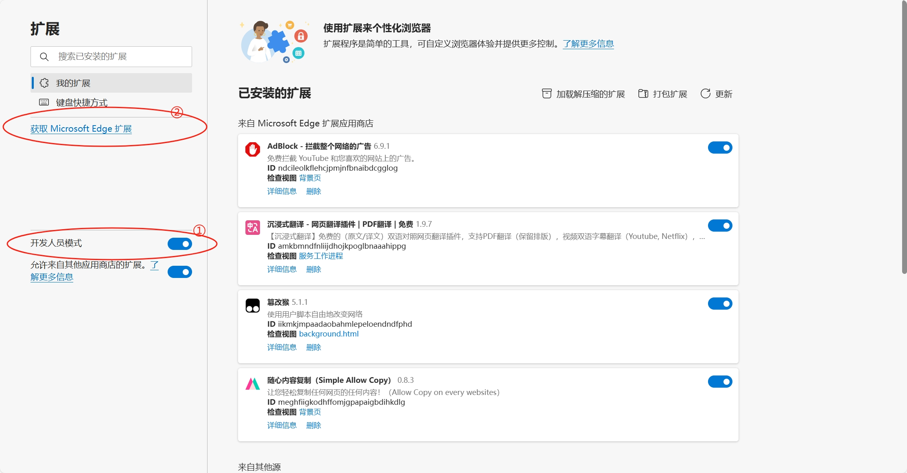
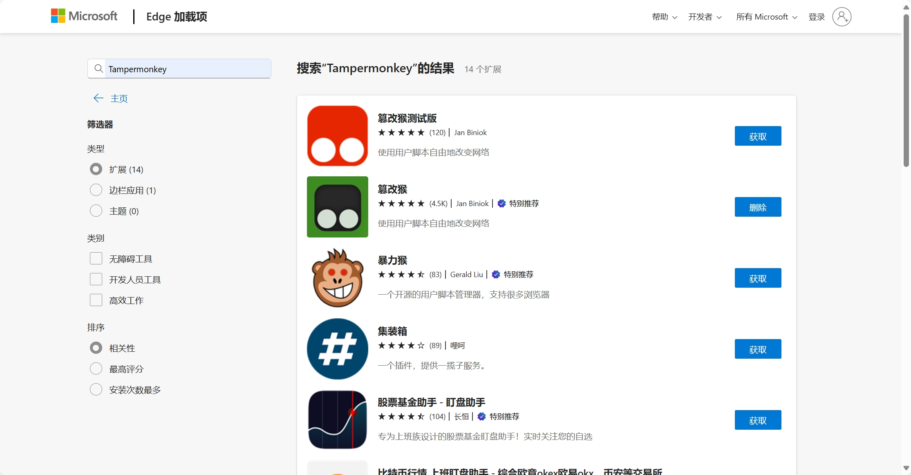
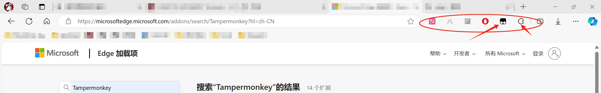
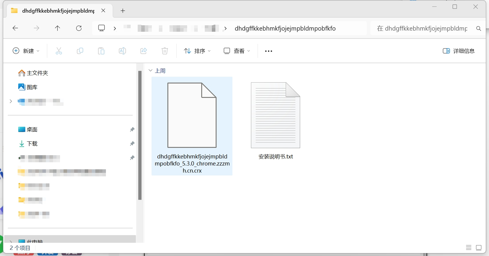
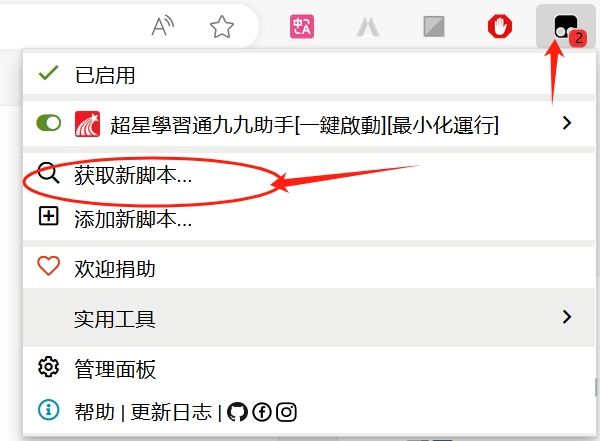
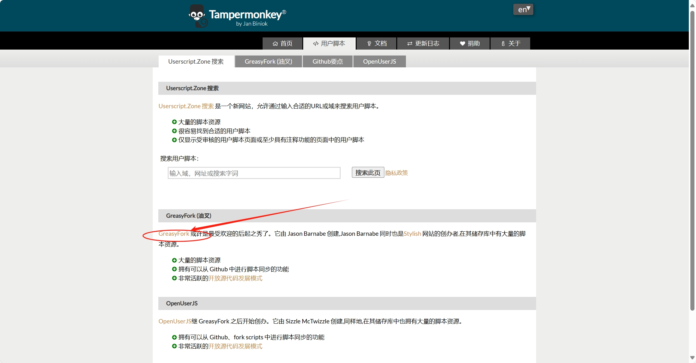
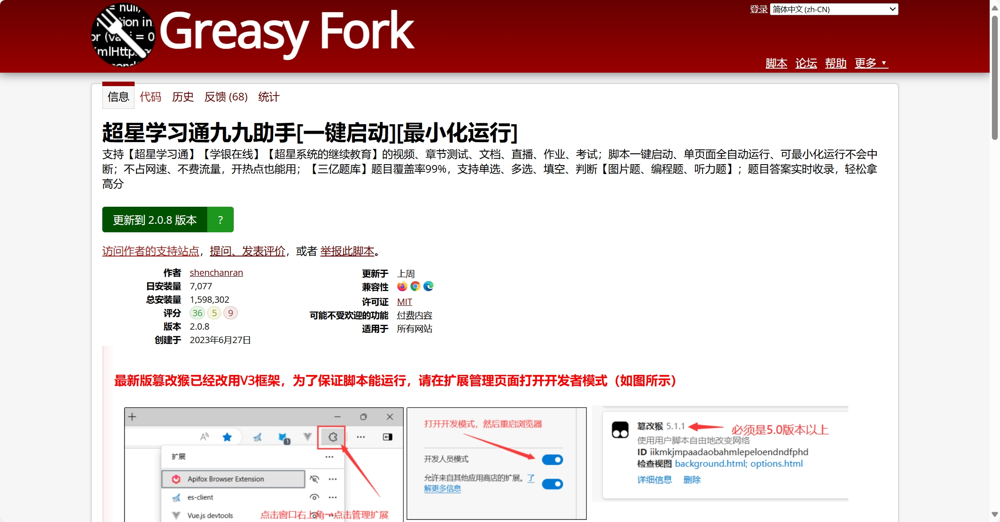
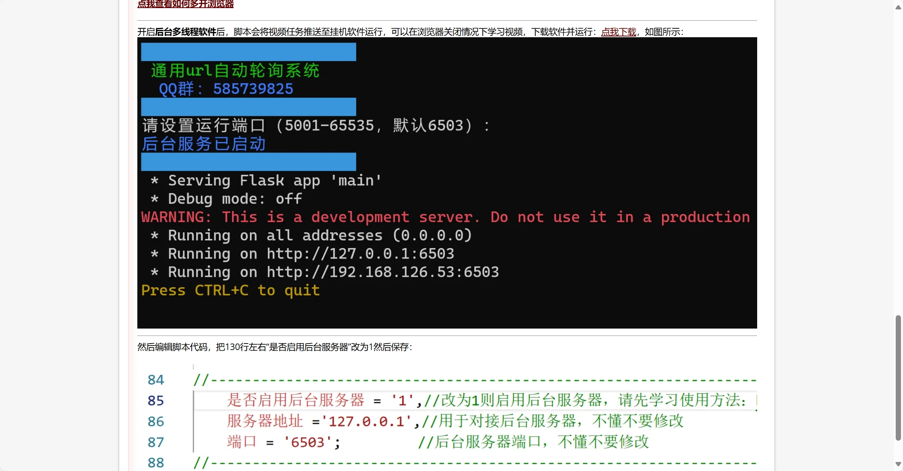

*Working：本文尚未完结* 
*本文章所介绍的方法仅供参考，请确保阅读并完全同意**重要声明**[^1][^2]*

## 概述

本文旨在介绍一套方法论，使得同学们可以搭建一个超星自动化刷课工具。并实现高效率挂机刷大水课。

**目录**
1. 配置 chromium 内核浏览器
2. 配置 Tampermonkey 插件
3. 安装 超星學習通九九助手[一鍵啟動][最小化運行] 插件
4. 如何刷课
5. 【进阶】配置本地服务器
6. 【进阶】配置题库

## 配置 Chromium 内核浏览器

为了顺利使用超星自动化刷课工具，首先需要在电脑上安装一个基于 Chromium 内核的浏览器。这是因为许多自动化脚本和插件依赖于 Chromium 提供的兼容性和功能。以下是几款常用的 Chromium 内核浏览器，你可以根据自己的需求选择：

1. [Microsoft Edge](https://www.microsoft.com/zh-cn/edge)
是 Windows 系统预制的浏览器。**本文演示将基于 Edge 进行。**

2. [Google Chrome](https://www.google.com/intl/zh-CN/chrome/)
是全球使用最广泛的浏览器之一，以其快速的加载速度和丰富的扩展生态系统著称。

3. [Opera](https://www.opera.com/zh-cn)
是一款功能丰富的浏览器，内置 VPN 和广告拦截器等实用工具，提升用户隐私保护和浏览体验。* 

如果你不熟悉如何安装浏览器或对不同浏览器的选择存在疑问，可以参考微软官方提供的[切换到 Microsoft Edge 以获取更好的浏览体验](https://support.microsoft.com/zh-cn/microsoft-edge/%E5%88%87%E6%8D%A2%E5%88%B0-microsoft-edge-%E4%BB%A5%E8%8E%B7%E5%8F%96%E6%9B%B4%E5%A5%BD%E7%9A%84%E6%B5%8F%E8%A7%88%E4%BD%93%E9%AA%8C-160fa918-d581-4932-9e4e-1075c4713595#:~:text=%E6%9C%89%E5%85%B3%E5%A6%82%E4%BD%95%E4%B8%8B%E8%BD%BD%E5%92%8C%E5%AE%89%E8%A3%85%20Microsoft%20Edge%20%E7%9A%84%E6%AD%A5%E9%AA%A4%201%20%E8%BD%AC%E5%88%B0%20Microsoft%20Edge,%E4%B8%8B%E8%BD%BD%20%E2%80%9D%E6%8C%89%E9%92%AE%E5%B9%B6%E5%90%8C%E6%84%8F%E6%9D%A1%E6%AC%BE%20%26%20%E6%9D%A1%E4%BB%B6%E3%80%82%205%20%E8%BF%90%E8%A1%8C%E5%AE%89%E8%A3%85%E7%A8%8B%E5%BA%8F%20-%20%E6%B5%8F%E8%A7%88%E5%99%A8%E5%B0%86%E5%9C%A8%E4%B8%8B%E8%BD%BD%E5%90%8E%E5%BC%80%E5%A7%8B%E4%B8%8B%E8%BD%BD%E5%B9%B6%E5%AE%89%E8%A3%85%E3%80%82)文章以学习Microsoft Edge的下载

## 配置 Tampermonkey 插件

Tampermonkey 是一款流行的浏览器扩展，允许用户在网页上运行自定义 JavaScript 脚本，实现自动化任务和个性化功能。下面笔者介绍在 Microsoft Edge 浏览器中获取 Tampermonkey 插件的三种方法：

### 方法一：从 Edge 官方插件商城获取

1. 打开 Edge 浏览器。
2. 在地址栏输入``edge://extensions/``，打开 edge 管理扩展。
3. 在页面的左下角，打开“开发者模式”，点击“获取扩展程序”链接。 

4. 在 [Edge 插件商城](https://microsoftedge.microsoft.com/addons/Microsoft-Edge-Extensions-Home?hl=zh-CN)中，搜索“Tampermonkey”。 

5. 找到 [Tampermonkey](https://microsoftedge.microsoft.com/addons/detail/%E7%AF%A1%E6%94%B9%E7%8C%B4/iikmkjmpaadaobahmlepeloendndfphd?hl=zh-CN) 插件，点击“获取”按钮。
6. 确认安装，插件安装完成后，Tampermonkey 图标将出现在浏览器工具栏中。

### 方法二：从极简插件网站获取

极简插件网站是Chrome浏览器扩展插件商店的搬运工，无需翻墙即可访问。

1. 打开 Edge 浏览器。
2. 访问[极简插件](https://chrome.zzzmh.cn/)。
3. 通过搜索找到 [Tampermonkey](https://chrome.zzzmh.cn/info/dhdgffkkebhmkfjojejmpbldmpobfkfo) 插件。
4. 点击“推荐下载”或“备用下载”按钮，获得包含插件的安装包，解压并获得插件文件。 

5. 在地址栏输入``edge://extensions/``，打开 edge 管理扩展，设置左侧的``开发人员模式``为开启。

6. 将 Tampermonkey 插件从文件资源管理器拖入edge 管理扩展页面中。
7. 确认安装，插件安装完成后，Tampermonkey 图标将出现在浏览器工具栏中。

### 方法三：从 Google Chrome 插件商城获取
本方法需要海外网络连接，请读者自行配置。

1. 打开 Edge 浏览器。
2. 访问 [Google Chrome 插件商城](https://chrome.google.com/webstore)。
3. 在搜索框中输入“Tampermonkey”，按下 Enter 键。
4. 找到 Tampermonkey 插件，点击“添加到 Chrome”按钮。
5. 浏览器会提示你确认安装，点击“添加扩展程序”。
6. 安装完成后，Tampermonkey 图标将出现在浏览器工具栏中。

## 安装 超星學習通九九助手[一鍵啟動][最小化運行] 插件
*超星學習通九九助手[一鍵啟動][最小化運行] 插件仅作为一个**演示插件**，读者也可以自行选择更好的插件，并分享到评论区*

超星学习通九九助手是一款用于自动化刷课的JavaScript 脚本，该脚本基于 Tampermonkey 插件运行。以下是安装该插件的方法：

### 从GreasyFork获取脚本

1. 点击 Tampermonkey 插件图标。
2. 点击获取新脚本，进入[ Tampermonkey 脚本黄页](https://www.tampermonkey.net/scripts.php)

3. 点击 GreasyFork 链接，进入 [GreasyFork官网](https://greasyfork.org/zh-CN)

4. 搜索“超星学习通九九助手”，找到该[脚本](https://greasyfork.org/zh-CN/scripts/469522-%E8%B6%85%E6%98%9F%E5%AD%A6%E4%B9%A0%E9%80%9A%E4%B9%9D%E4%B9%9D%E5%8A%A9%E6%89%8B-%E4%B8%80%E9%94%AE%E5%90%AF%E5%8A%A8-%E6%9C%80%E5%B0%8F%E5%8C%96%E8%BF%90%E8%A1%8C)页面，点击“安装”

5. 在弹出的 Tampermonkey 页面中，点击安装。

## 如何刷课

1. 打开[超星学习通](https://v8.chaoxing.com/)。
2. 登录账号，打开要刷的课。
3. 点击弹出的刷课弹窗。

4. 点击闯关模式开始刷课（读者可自行购买题库token）。
5. **没有配置本地服务器的同学需要保持刷课页面是被选中状态**

## 进阶
此部分笔者还未完成，但读者可以在以下页面找到支持：

1. [【进阶】配置本地服务器](https://greasyfork.org/zh-CN/scripts/469522-%E8%B6%85%E6%98%9F%E5%AD%A6%E4%B9%A0%E9%80%9A%E4%B9%9D%E4%B9%9D%E5%8A%A9%E6%89%8B-%E4%B8%80%E9%94%AE%E5%90%AF%E5%8A%A8-%E6%9C%80%E5%B0%8F%E5%8C%96%E8%BF%90%E8%A1%8C/code)

2. 【进阶】配置题库

## Reference

1. [The Chromium Projects](https://www.chromium.org/chromium-projects/)
2. [Tampermonkey](https://github.com/Tampermonkey/tampermonkey)
3. [Greasy Fork-超星学习通九九助手](https://greasyfork.org/zh-CN/scripts/469522-%E8%B6%85%E6%98%9F%E5%AD%A6%E4%B9%A0%E9%80%9A%E4%B9%9D%E4%B9%9D%E5%8A%A9%E6%89%8B-%E4%B8%80%E9%94%AE%E5%90%AF%E5%8A%A8-%E6%9C%80%E5%B0%8F%E5%8C%96%E8%BF%90%E8%A1%8C/code)

[^1]:本文所介绍的内容仅作为技术探索和学习交流之用，意在分享一些关于自动化脚本和技术应用的知识与经验。文中涉及的所有操作方法、工具及第三方资源（包括但不限于自动化脚本、题库等），仅供读者参考，作者**不对任何人在未经授权情况下使用这些工具、脚本或资源承担任何责任。**请读者务必遵守相关法律法规及平台的使用规定，不得使用本文中的方法从事任何违反超星学习通平台规则、侵犯他人权益或不正当竞争的行为。任何因滥用这些技术导致的后果均由读者自行承担，与作者无关。

[^2]:同时，本文所提及的第三方资源（如题库等）均为作者参考资料，作者不对其**准确性、合法性、实时性**等做出任何保证。请读者自行判断其有效性，并在合法合规的前提下使用。

