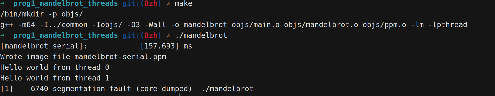

*本库包含作业答案，请确保阅读并完全同意[重要声明](https://baozhuhan.github.io//p/2024070101/)*

## Abstract

## Version 1

### TODO

> Modify the code in mandelbrot.cpp to parallelize the Mandelbrot generation using two cores. Specifically, compute the top half of the image in thread 0, and the bottom half of the image in thread 1. This type of problem decomposition is referred to as spatial decomposition since different spatial regions of the image are computed by different processors

### Workflow

1. Init Liunx System(Ubuntu 24.04 LTS), install ISPC, gcc, etc. build the develop environment.
2. Learn what is ``Mandelbrot set``

> **Here is the details** (Latex supported form GPT):
> The **Mandelbrot set** is the set of complex numbers \( c \) for which the function

> $$
> z_{n+1} = z_n^2 + c
> $$

> does not diverge when iterated from \( z_0 = 0 \). In other words, the Mandelbrot set consists of all complex numbers \( c \) for which the sequence

> $$
> z_0 = 0,\ z_1 = c,\ z_2 = z_1^2 + c,\ z_3 = z_2^2 + c,\ \dots
> $$

> remains bounded, i.e., there exists a constant \( M \) such that for all \( n \),

> $$
> |z_n| \leq M.
> $$

3. Code review. (mandelbrot.cpp)

> **Here are the details**
> 

### Result

